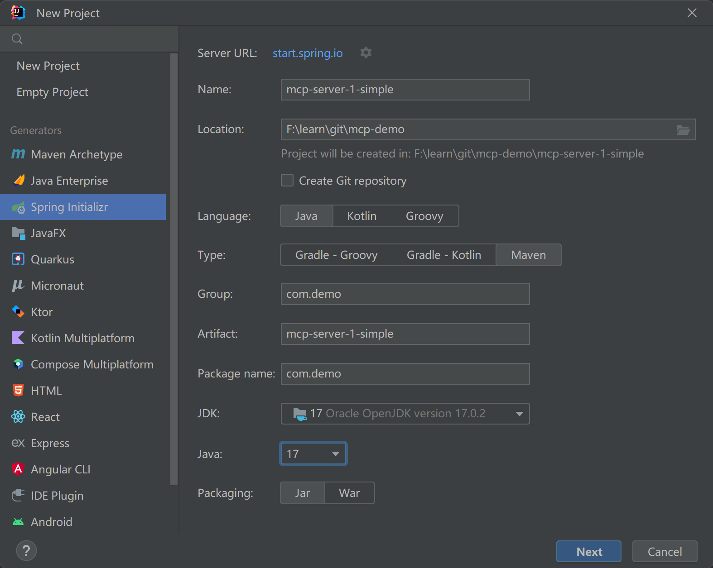
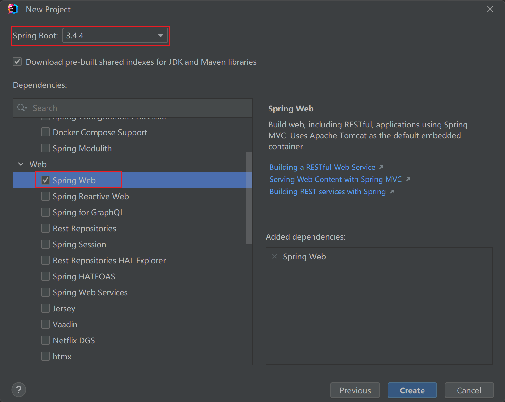
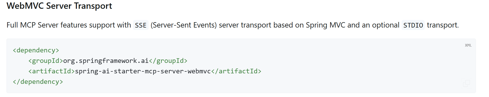
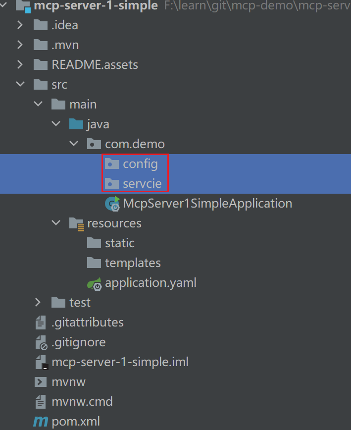
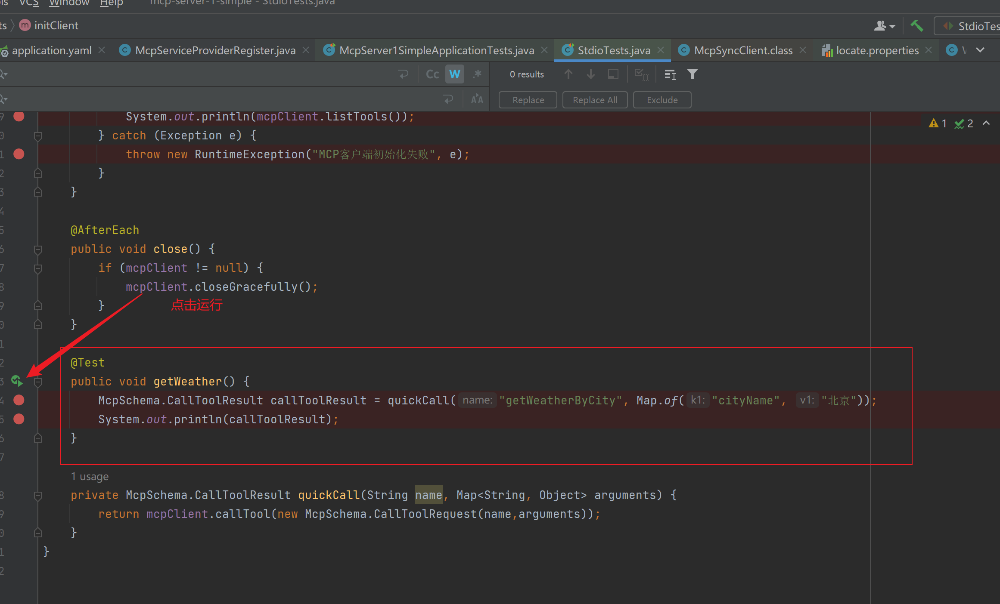
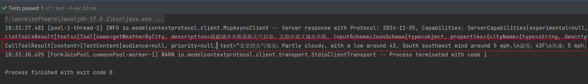
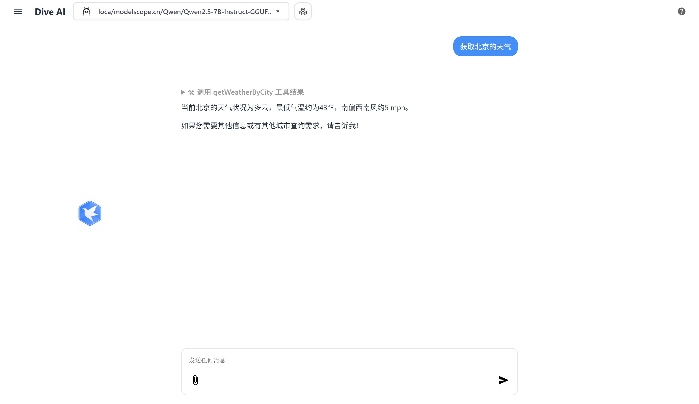
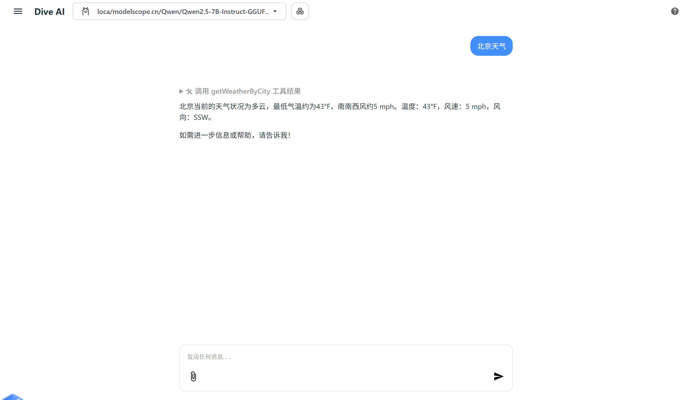

# MCP Server实现（基于SpringBoot）

> 参考手册：
>
> 1.[面向服务器开发者 - MCP 中文文档](https://mcp-docs.cn/quickstart/server)
>
> 2.[MCP Server Boot Starter :: Spring AI Reference](https://docs.spring.io/spring-ai/reference/api/mcp/mcp-server-boot-starter-docs.html)
>
> 3.[MCP 服务器 – MCP 中文站（Model Context Protocol 中文）](https://mcpcn.com/docs/sdk/java/mcp-server/)
>
> 4.https://gitee.com/dreamcenter/springboot-mcpserver-junit/


## 一、系统要求

- 已安装 Java 17 或更高版本。
- [Spring Boot 3.3.x](https://docs.spring.io/spring-boot/installing.html) 或更高版本


## 二、运行模式

### 两种运行模式

#### STDIO（**Standard Input/Output**）

- **基于进程通信**：通过标准输入(stdin)和标准输出(stdout)与父进程通信
- **同步交互**：请求-响应式的工作方式
- **简单直接**：适合本地部署和简单集成
- **低延迟**：由于是直接进程间通信，通常延迟较低
- **适用场景**：
  - 本地开发环境
  - 命令行工具集成
  - 需要快速原型开发的情况

#### SSE（**Server-Sent Events**）

1. **基于HTTP协议**：使用长连接通过HTTP传输数据
2. **异步通信**：服务器可以主动推送消息到客户端
3. **事件驱动**：基于事件的消息机制
4. **适用场景**：
   - Web应用集成
   - 需要实时更新的场景
   - 跨网络通信
   - 浏览器客户端集成

### 如何选择

- 选择**stdio模式**：
  - 你需要在本地环境中快速集成
  - 对延迟敏感
  - 不需要网络通信
- 选择**SSE模式**：
  - 你需要通过网络访问MCP服务
  - 你的客户端是Web浏览器
  - 你需要服务器主动推送能力
  - 需要更好的错误处理和重连机制

## 三、项目创建

### 1、使用 [Spring Initializer](https://start.spring.io/) 来 bootstrap 项目

这里`Language`我们选择`Java`，`Type`选择`Maven`，`JDK`的版本选择`17`，`Packaging`选择`Jar`，其他选项均可根据实际情况进行修改。



因为`MCP SDK`对`SpringBoot`版本有要求，必须选择`3.3.x+`，至于以来选个`web`启动器即可。



### 2、添加dependencies

在`pom.xml`文件`<dependencies>`标签下添加如下内容：

```xml
	<properties>
		<java.version>17</java.version>
		<spring-ai.version>1.0.0-M7</spring-ai.version>
	</properties>
```

在`pom.xml`文件`<dependencies>`标签下添加如下内容：

```xml
<!-- mcp server  -->
<dependency>
    <groupId>org.springframework.ai</groupId>
    <artifactId>spring-ai-starter-mcp-server-webmvc</artifactId>
    <version>${spring-ai.version}</version>
</dependency>

<dependency>
    <groupId>com.fasterxml.jackson.core</groupId>
    <artifactId>jackson-databind</artifactId>
</dependency>
<dependency>
    <groupId>org.projectlombok</groupId>
    <artifactId>lombok</artifactId>
    <optional>true</optional>
</dependency>
```

> **我们引入依赖两种模式都已支持，默认为SSE模式，需要服务端启动项目，客户端可以通过服务的ip:port/sse端口访问；STDIO模式是可选项，必须使用jar运行，并且通过配置`spring.ai.mcp.server.stdio=true`开启；**
>
> 


### 3、关闭日志和Banner输出

在`application.yaml`文件添加如下内容：

```yaml
# stdio模式必须配置；sse模式不用配置
logging:
  pattern:
    console:
spring:
  main:
    banner-mode: off
    
# 服务端口
server:
  port: 8081
```


### 4、新增两个package

```bash
src/main/java/com/demo
├─config   # 存放配置类以及MCP Service Provider Register
└─servcie  # 存放MCP Service Provider

```



### 5、新增McpServiceProviderRegister

在`config`包下新建`McpServiceProviderRegister.java`，该类将用于注册写好service服务，暴露给`client`端使用，其如下内容：

```java
@Configuration
public class McpServiceProviderRegister {

    // TODO 注册一个MCP Service Provider
    @Bean
    public ToolCallbackProvider weatherTools(WeatherService weatherService) {
        return MethodToolCallbackProvider.builder().toolObjects(weatherService).build();
    }
}
```


### 6、新增`Junit`测试类

#### StdioTests

```java
public class StdioTests {

    private static String jarFilePath;
    private McpSyncClient mcpClient;

    @BeforeAll
    public static void init() throws URISyntaxException {
        URL resource = StdioTests.class.getClassLoader().getResource("locate.properties"); // locate.properties是test resources下配置文件
        Assertions.assertNotNull(resource, "load junit classLoader context fail");

        Path targetPath = Paths.get(resource.toURI()).getParent().getParent();

        File files = targetPath.toFile();
        File[] files1 = files.listFiles(file -> (file.getName().endsWith(".jar")));

        Assertions.assertNotNull(files1, "Not validate directory");
        Assertions.assertNotEquals(0, files1.length, "Can not find the generated jar file under [target] directory");
        Assertions.assertEquals(1, files1.length, "Find more then one jar file under [target] directory");

        jarFilePath = files1[0].getAbsolutePath();
    }

    @BeforeEach
    public void initClient(){
        ServerParameters serverParameters = ServerParameters.builder("java")
                .args("-jar", "-Dfile.encoding=UTF-8", "-Dspring.ai.mcp.server.stdio=true", jarFilePath)
                .build();
        mcpClient = McpClient.sync(new StdioClientTransport(serverParameters)).build();

        // 验证客户端是否正确初始化
        try {
            mcpClient.initialize();
            System.out.println(mcpClient.listTools());
        } catch (Exception e) {
            throw new RuntimeException("MCP客户端初始化失败", e);
        }
    }

    @AfterEach
    public void close() {
        if (mcpClient != null) {
            mcpClient.closeGracefully();
        }
    }

    @Test
    public void getWeather() {
        McpSchema.CallToolResult callToolResult = quickCall("getWeatherByCity", Map.of("cityName", "北京"));
        System.out.println(callToolResult);
    }

    private McpSchema.CallToolResult quickCall(String name, Map<String, Object> arguments) {
        return mcpClient.callTool(new McpSchema.CallToolRequest(name,arguments));
    }
}
```


#### SseTests

```java
public class SseTests {

    private static String host;
    private static int port;
    private McpSyncClient mcpClient;
    private static Process startedProcess;

    @BeforeAll
    public static void init() throws URISyntaxException, IOException {
        // get test properties
        URL resource = SseTests.class.getClassLoader().getResource("locate.properties");
        Assertions.assertNotNull(resource, "load junit classLoader context fail");

        // get init port
        Properties properties = new Properties();
        properties.load(resource.openStream());
        port = Integer.parseInt(properties.getProperty("port", "8080"));
        host = properties.getProperty("host", "localhost");

        // find jar file
        Path targetPath = Paths.get(resource.toURI()).getParent().getParent();

        File files = targetPath.toFile();
        File[] files1 = files.listFiles(file -> (file.getName().endsWith(".jar")));

        // start the jar if not running.
        try (Socket ignored = new Socket(host, port)) {
            System.out.println("port " + port + " at host " + "localhost" + " is open。");
        } catch (IOException e) {
            // Check if not started.
            Assertions.assertNotNull(files1, "Not validate directory");
            Assertions.assertNotEquals(0, files1.length, "Can not find the generated jar file under [target] directory");
            Assertions.assertEquals(1, files1.length, "Find more then one jar file under [target] directory");

            String jarFilePath = files1[0].getAbsolutePath();

            System.out.println("port " + port + " at host " + "localhost" + "  is close or unreachable。opening...");
            ProcessBuilder process = new ProcessBuilder("java", "-jar", jarFilePath);
            startedProcess = process.start();
            System.out.println("service opened.");
        }

        // make sure program started
        Assertions.assertDoesNotThrow(() -> TimeUnit.SECONDS.sleep(5));

    }

    @AfterAll
    public static void destroy() {
        if (startedProcess != null) {
            startedProcess.destroy();
        }
    }

    @BeforeEach
    public void initClient() {
        mcpClient = McpClient.sync(new HttpClientSseClientTransport("http://" + host + ":" + port)).build();

        // 验证客户端是否正确初始化
        try {
            mcpClient.initialize();
            System.out.println(mcpClient.listTools());
        } catch (Exception e) {
            throw new RuntimeException("MCP客户端初始化失败", e);
        }
    }

    @AfterEach
    public void close() {
        if (mcpClient != null) {
            mcpClient.closeGracefully();
        }
    }

    @Test
    public void getWeather() {
        McpSchema.CallToolResult callToolResult = quickCall("getWeatherByCity", Map.of("cityName", "北京"));
        System.out.println(callToolResult);
    }


    private McpSchema.CallToolResult quickCall(String name, Map<String, Object> arguments) {
        return mcpClient.callTool(new McpSchema.CallToolRequest(name,arguments));
    }
}
```


### 7、两个注解

#### **1. `@Tool` 注解**

##### **作用**

- **标记工具方法**：`@Tool`用于标注一个方法，表明该方法可被AI模型作为工具调用。这些方法通常用于扩展AI的功能，例如查询数据库、执行计算或调用外部API。
- **定义工具元数据**：通过注解的属性（如`name`、`description`）提供方法的名称和功能描述，帮助AI模型理解何时调用此工具。

##### **使用示例**

```java
@Tool(name = "天气查询", description = "根据城市名称查询实时天气")
public Weather getWeather(@ToolParam("城市名称") String city) {
    // 调用天气API并返回结果
}
```

---

#### **2. `@ToolParam` 注解**

##### **作用**

- **参数元数据定义**：标注方法参数，为AI模型提供参数的名称、描述和是否必填等信息，确保AI在调用工具时能正确传递参数。
- **类型约束**：支持定义参数的类型（如字符串、数值等），帮助AI生成符合要求的输入。

##### **使用示例**

```java
public class Calculator {
    @Tool(name = "加法计算", description = "对两个数字求和")
    public int add(
        @ToolParam(name = "a", description = "第一个加数", required = true) int a,
        @ToolParam(name = "b", description = "第二个加数") int b
    ) {
        return a + b;
    }
}
```

---

#### **核心功能与使用场景**

1. **函数调用集成**  
   Spring AI通过`@Tool`和`@ToolParam`将Java方法暴露给AI模型。例如，当用户提问“北京今天多少度？”时，AI可以自动调用标记为`@Tool`的天气查询方法，并传递`@ToolParam`定义的参数。

2. **动态参数处理**  

   - `required`属性：标记参数是否必填（默认`true`），若未提供则抛出异常。
   - 类型校验：若参数类型不匹配（如传递字符串给数值参数），Spring AI会拦截请求并返回错误。

3. **与Prompt工程结合**  
   开发者可在提示词中引导AI调用特定工具。例如：

   ```java
   String prompt = "请查询北京的天气，并使用‘天气查询’工具。";
   ```

---

#### **注意事项**

1. **依赖注入**：工具类需注册为Spring Bean，确保能被Spring AI扫描到。
2. **模型兼容性**：需使用支持函数调用的模型（如OpenAI GPT-4或通义千问）。
3. **安全性**：暴露给AI的工具方法应限制权限，避免敏感操作被滥用。


## 四、构建服务

3. 


### Weather Service

在`service`包下新建`WeatherService.java`，该类将会通过网络调用`National Weather`服务，获取实时天气信息

#### 代码实现

```java
@Slf4j
@Service
public class WeatherService {

    private final RestClient restClient;
    private final Map<String, String> cityCoordinates;

    public WeatherService() {
        this.restClient = RestClient.builder()
                .baseUrl("https://api.weather.gov")
                .defaultHeader("Accept", "application/geo+json")
                .defaultHeader("User-Agent", "WeatherApiClient/1.0 (your@email.com)")
                .build();
        
        // 初始化城市坐标映射
        this.cityCoordinates = new HashMap<>();
        cityCoordinates.put("北京", "39.9042,-116.4074");
        cityCoordinates.put("上海", "31.2304,121.4737");
        cityCoordinates.put("广州", "23.1291,113.2644");
        cityCoordinates.put("深圳", "22.5431,114.0579");
        // 可以添加更多城市坐标
    }

    @Tool(name = "getWeatherByCity", description = "根据城市名称获取天气信息，支持中英文城市名称")
    public String getWeatherByCity(@ToolParam(description = "城市名称") String cityName) {
        try {
            // 获取城市坐标
            String coordinates = cityCoordinates.get(cityName);
            if (coordinates == null) {
                return "暂不支持该城市的天气查询";
            }
            
            // 获取网格点信息
            JsonNode pointsResponse = restClient.get()
                    .uri("/points/{coordinates}", coordinates)
                    .retrieve()
                    .body(JsonNode.class);

            if (pointsResponse == null) {
                return "无法获取天气信息";
            }

            // 获取预报URL
            String forecastUrl = pointsResponse.path("properties").path("forecast").asText();
            
            // 获取天气预报
            JsonNode forecastResponse = restClient.get()
                    .uri(forecastUrl)
                    .retrieve()
                    .body(JsonNode.class);

            if (forecastResponse != null) {
                JsonNode periods = forecastResponse.path("properties").path("periods");
                if (periods.isArray() && periods.size() > 0) {
                    JsonNode currentPeriod = periods.get(0);
                    String name = currentPeriod.path("name").asText();
                    String detailedForecast = currentPeriod.path("detailedForecast").asText();
                    String temperature = currentPeriod.path("temperature").asText();
                    String temperatureUnit = currentPeriod.path("temperatureUnit").asText();
                    String windSpeed = currentPeriod.path("windSpeed").asText();
                    String windDirection = currentPeriod.path("windDirection").asText();
                    
                    return String.format("%s的天气情况：%s\n温度：%s%s\n风速：%s，风向：%s", 
                        cityName, detailedForecast, temperature, temperatureUnit, windSpeed, windDirection);
                }
            }
            return "无法获取天气信息";
        } catch (Exception e) {
            log.error("获取天气信息失败", e);
            return "获取天气信息失败：" + e.getMessage();
        }
    }

    @Tool(name = "getWeatherByLocation", description = "根据经纬度获取天气信息")
    public String getWeatherByLocation(@ToolParam(description = "纬度") double lat, @ToolParam(description = "经度") double lon) {
        try {
            // 获取网格点信息
            JsonNode pointsResponse = restClient.get()
                    .uri("/points/{lat},{lon}", lat, lon)
                    .retrieve()
                    .body(JsonNode.class);

            if (pointsResponse == null) {
                return "无法获取天气信息";
            }

            // 获取预报URL
            String forecastUrl = pointsResponse.path("properties").path("forecast").asText();
            
            // 获取天气预报
            JsonNode forecastResponse = restClient.get()
                    .uri(forecastUrl)
                    .retrieve()
                    .body(JsonNode.class);

            if (forecastResponse != null) {
                JsonNode periods = forecastResponse.path("properties").path("periods");
                if (periods.isArray() && periods.size() > 0) {
                    JsonNode currentPeriod = periods.get(0);
                    String name = currentPeriod.path("name").asText();
                    String detailedForecast = currentPeriod.path("detailedForecast").asText();
                    String temperature = currentPeriod.path("temperature").asText();
                    String temperatureUnit = currentPeriod.path("temperatureUnit").asText();
                    String windSpeed = currentPeriod.path("windSpeed").asText();
                    String windDirection = currentPeriod.path("windDirection").asText();
                    
                    return String.format("当前位置的天气情况：%s\n温度：%s%s\n风速：%s，风向：%s", 
                        detailedForecast, temperature, temperatureUnit, windSpeed, windDirection);
                }
            }
            return "无法获取天气信息";
        } catch (Exception e) {
            log.error("获取天气信息失败", e);
            return "获取天气信息失败：" + e.getMessage();
        }
    }
}
```

#### 注册`WeatherService`

在`config\McpServiceProviderRegister.java`中添加如下内容：

```java
@Bean
public ToolCallbackProvider weatherTools(WeatherService weatherService) {
    return MethodToolCallbackProvider.builder().toolObjects(weatherService).build();
}
```


#### 调用测试（Junit）

详细代码参照`项目创建》6、新增Junit测试类`



可以看到运行ok



#### 调用测试（Dive：STDIO模式）

配置文件

```json
{
  "mcpServers": {
    "mcp-server-1-simple": {
      "command": "java",
      "args": [
        "-jar",
        "-Dfile.encoding=UTF-8",
        "-Dspring.ai.mcp.server.stdio=true",
        "F:\\learn\\git\\mcp-demo\\mcp-server-1-simple\\target\\mcp-server-1-simple-0.0.1-SNAPSHOT.jar"
      ]
    }
  }
}
```



#### 调用测试（Dive：SSE模式）

- 使用前提，需要保证mcp server是否已经运行

配置文件

```json
{
  "mcpServers": {
    "mcp-server-1-simple": {
      "transport": "sse",
      "url": "http://localhost:8081/sse",
    }
  }
}
```

